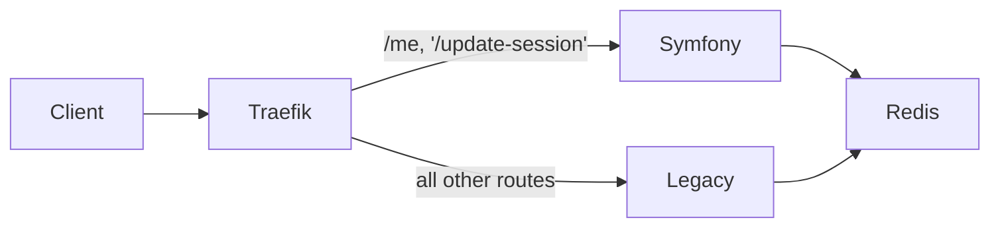

# 🪴 Strangler Fig Migration - Legacy PHP → Symfony (via Traefik Proxy)
 
> ⚠️ **Portfolio / Demo** — This repository is part of a personal portfolio

This project demonstrates a Strangler Fig migration pattern applied to a legacy PHP application, where a modern Symfony
7 service gradually replaces legacy endpoints behind a unified reverse proxy (Traefik 3).
The architecture follows a Proxy Strangler Pattern, not an inline replacement.
In this setup, both applications coexist, share session state via Redis, and are transparently served under the same
base domain.

## 🧱 Architecture Overview

### Components

- Legacy App (PHP 8.2 + Apache)  
  Existing monolithic application serving all routes by default.
  Uses native PHP sessions stored in Redis.

- Symfony App (PHP 8.3 + Apache)  
  New microservice providing modern endpoints (e.g. /me, /change).
  Reads and writes the same session data via $_SESSION, fully compatible with the legacy Redis session store.

- Redis 7  
  Centralized session store (session.save_handler = redis, prefix=sess_) for both apps.

- Traefik 3.0  
  Acts as a smart reverse proxy.
  Routes traffic based on path prefixes:

### 🌐 Architecture Diagram



## ⚙️ Routing Setup (Proxy Mode)

Dynamic routing (traefik/dynamic.yml):

```
http:
  routers:
    symfony_me:
      rule: "PathPrefix(`/me`)"
      service: symfony_service

    symfony_change:
      rule: "PathPrefix(`/update-session`)"
      service: symfony_service

    legacy_fallback:
      rule: "PathPrefix(`/`)"
      service: legacy_service

  services:
    legacy_service:
      loadBalancer:
        servers:
          - url: "http://legacy:80"

    symfony_service:
      loadBalancer:
        servers:
          - url: "http://symfony:80"
```

## 🔄 Session Sharing

Both containers share a Redis-backed PHP session:

```
session.save_handler = redis
session.save_path = "tcp://redis:6379?prefix=sess_"
session.name = PHPSESSID
```

No Symfony SessionInterface is used.
Instead, Symfony consumes the native PHP session directly (`$_SESSION`), enabling zero-friction interoperability.
This ensures that a user logged in via the legacy app remains authenticated when accessing the new Symfony routes.

## 🚀 How It Works

1. User logs in via legacy app (`http://localhost`) → session is stored in Redis.
2. Traefik intercepts requests:  
   => `/me`, `/update-session` → sent to Symfony container  
   => all others → sent to legacy container
3. Symfony reads the existing Redis session, extending or mutating data.
4. Gradually, more endpoints are implemented in Symfony until the legacy system can be fully retired.

## 🧪 Demo Routes

| Endpoint        | Routed To | Description                                |
|-----------------|-----------|--------------------------------------------|
| /               | Legacy    | Legacy login & session initialization      |      
| /me             | Symfony   | Reads session shared via Redis             |    
| /update-session | Symfony   | Mutates session and persists back to Redis | 

## 🧰 Run Locally

`docker compose up --build -d`

Then open:

- Legacy: http://localhost/
- Symfony endpoint: http://localhost/me or http://localhost/update-session
- Traefik Dashboard: http://localhost:8081/
