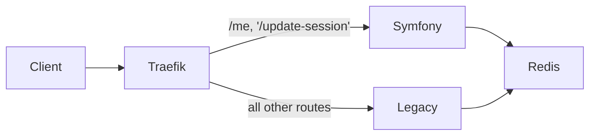

# Strangler Fig Migration - Legacy PHP → Symfony (via Traefik Proxy)
 
> ⚠️ **Portfolio / Demo** — This repository is part of a personal portfolio

This project demonstrates a Strangler Fig migration pattern applied to a legacy PHP application, where a modern Symfony
7 service gradually replaces legacy endpoints behind a unified reverse proxy (Traefik 3).
The architecture follows a Proxy Strangler Pattern, not an inline replacement.
In this setup, both applications coexist, share session state via Redis, and are transparently served under the same
base domain.

## The Problem
Migrating large legacy systems via "Big Bang" releases is risky and often leads to downtime or regression. This project demonstrates how to use the **Strangler Fig Pattern** to incrementally replace legacy PHP code. By running both applications in parallel and routing traffic transparently, we achieve a **zero-downtime migration** while maintaining continuous delivery.

## Key Architectural Decisions
- **Traefik as a Facade:** Acts as the central "brain" (Reverse Proxy) to intercept requests. It decides based on path-prefixes whether a request is handled by the Legacy container or the new Symfony service.
- **Shared Session State (Redis):** To ensure a seamless User Experience, both apps share the same Redis store. A user can log in via Legacy and immediately access protected routes in Symfony without re-authenticating.
- **Native Interoperability:** Symfony consumes the native `$_SESSION` directly to avoid complex mapping layers during the migration phase.

## When to use this
Best suited for monoliths that are too large to rewrite at once. It allows teams to deliver new business value in Symfony immediately, while slowly "strangling" the old system until it can be retired.

## Architecture Overview

### Components

- **Legacy App (PHP 8.2 + Apache):** Existing monolithic application serving all routes by default. It uses native PHP sessions stored in Redis.
- **Symfony App (PHP 8.3 + Apache):** New service providing modern endpoints (e.g., `/me`, `/update-session`). It interacts directly with `$_SESSION` for full compatibility with the legacy store.
- **Redis 7:** Centralized session store (`session.save_handler = redis`, `prefix=sess_`) shared by both applications to ensure seamless user transitions.
- **Traefik 3.0:** Acts as the intelligent entry point (Reverse Proxy) that routes traffic based on path prefixes and manages the coexistence of both systems.

### Architecture Diagram



## Routing Setup (Proxy Mode)

Dynamic routing (traefik/dynamic.yml):

```
http:
  routers:
    symfony_me:
      rule: "PathPrefix(`/me`)"
      service: symfony_service

    symfony_change:
      rule: "PathPrefix(`/update-session`)"
      service: symfony_service

    legacy_fallback:
      rule: "PathPrefix(`/`)"
      service: legacy_service

  services:
    legacy_service:
      loadBalancer:
        servers:
          - url: "http://legacy:80"

    symfony_service:
      loadBalancer:
        servers:
          - url: "http://symfony:80"
```

## Session Sharing

Both containers share a Redis-backed PHP session. This ensures that a user remains authenticated while moving between frameworks:

```
session.save_handler = redis
session.save_path = "tcp://redis:6379?prefix=sess_"
session.name = PHPSESSID
```

No Symfony SessionInterface is used.
Instead, Symfony consumes the native PHP session directly (`$_SESSION`), enabling zero-friction interoperability.
This ensures that a user logged in via the legacy app remains authenticated when accessing the new Symfony routes.

## How It Works

1. User logs in via legacy app (`http://localhost`) → session is stored in Redis.
2. Traefik intercepts subsequent requests.  
   => `/me`, `/update-session` → sent to Symfony container  
   => all others → sent to legacy container
3. Symfony reads the existing Redis session, extending or mutating data.
4. Incremental Migration: More routes are moved to Traefik’s Symfony-Router until the legacy app receives no more traffic.

## Demo Routes

| Endpoint        | Routed To | Description                                |
|-----------------|-----------|--------------------------------------------|
| /               | Legacy    | Legacy login & session initialization      |      
| /me             | Symfony   | Reads session shared via Redis             |    
| /update-session | Symfony   | Mutates session and persists back to Redis | 

## Run Locally

`docker compose up --build -d`

Then open:

- Legacy: http://localhost
- Symfony endpoint: http://localhost/me or http://localhost/update-session
- Traefik Dashboard: http://localhost:8081
